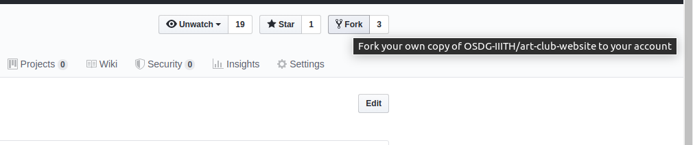

=======
# Art Society 
Art society was started in the summer of 2017 and hosted its first event in the monsoon 2017.

## How to contribute

### Rules
- No dev PRs against `master` branch. All dev pull requests should be raised against `develop` or custom branches only. 
- `design` branch contains all the design discussions only.
- Every PR needs at least 1 peer approval before it can be merged. 
- Use meaningful commit messages

### Forking the repo


1. Clone the repo:
```
git clone <url of forked repo>
```

2. Set `upstream`(new remote) to base repo so that you can keep your fork updated:
```
git remote add upstream https://github.com/OSDG-IIITH/art-club-website
```

3. Everytime you want to pull changes from base repo:
```
git pull upstream <branch-name>
```

### Submitting a pull request
- TODO

## Requirements
- TODO

## Instructions to run
- TODO

>>>>>>> 0ad06d8271230f8d6773a5adcec9e0168a5510bd
